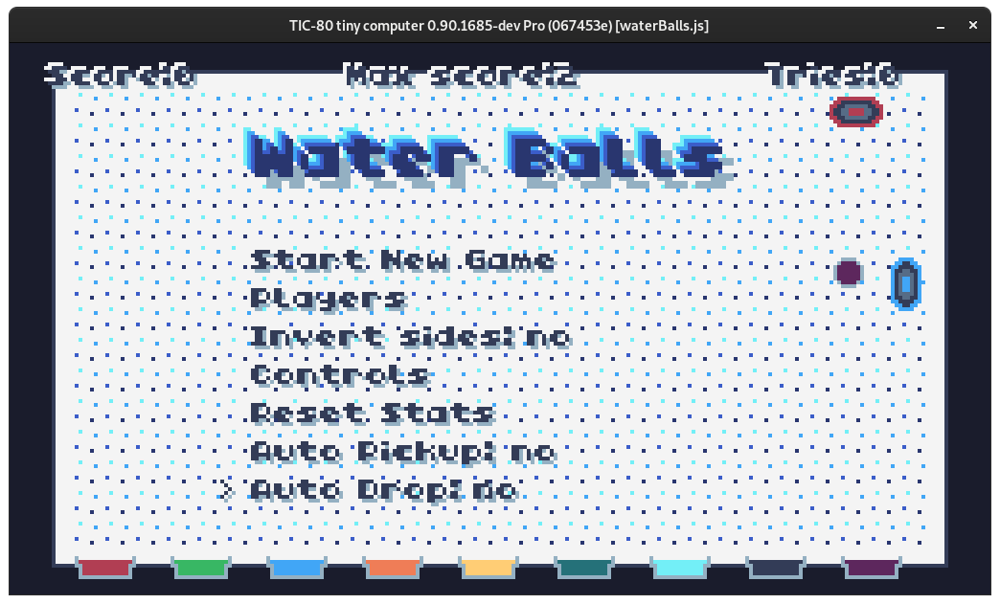
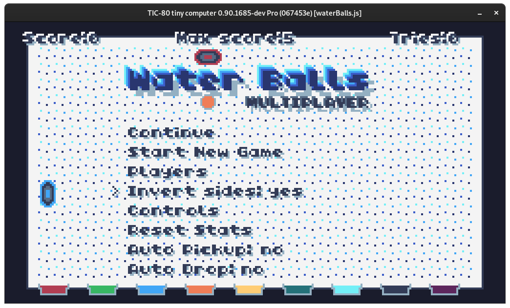
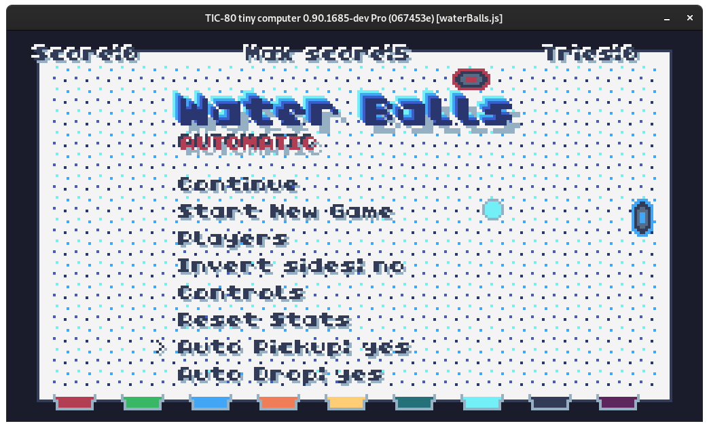
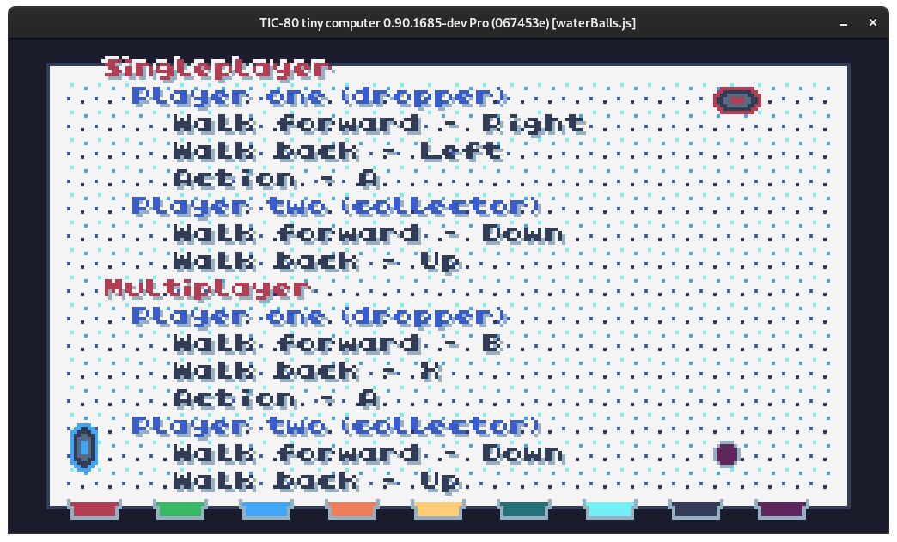
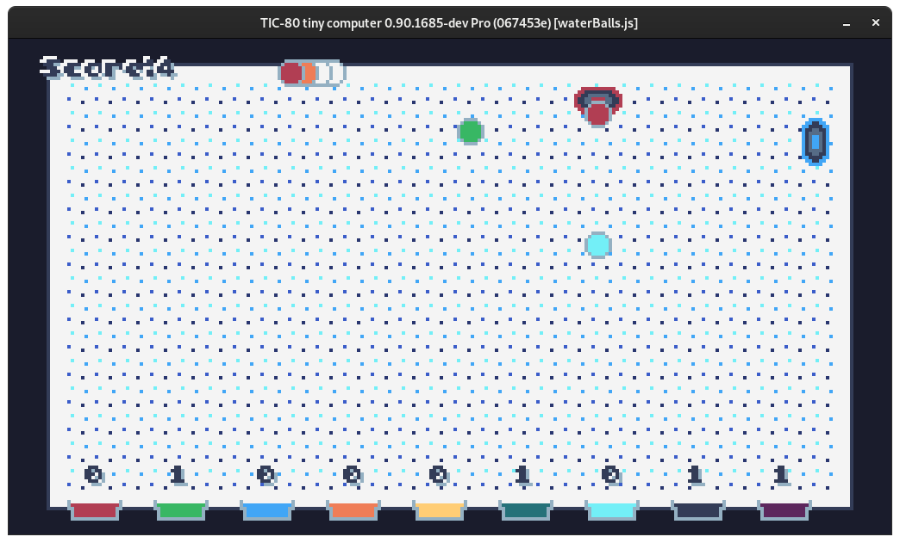
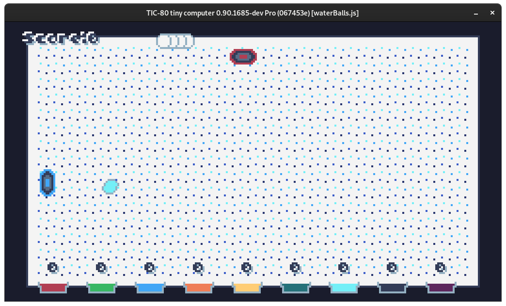
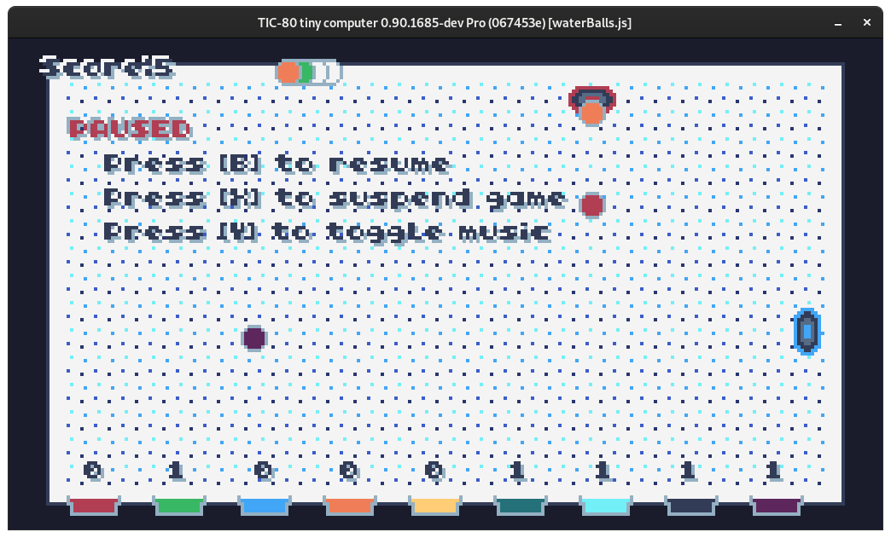

# EmptyHouse

**Organize these balls!**

## Features

- Continue game
- Toggle music
- Toggle automatic players (even full auto)
- Play with you friend in local multiplayer mode
- View controls
- Enable auto mode in mid game
- Invert the `collector` player sides

---

## Usage

```
$ tic80 src/waterBalls.js
```

## Images

_Menu_


---

_Menu Multiplayer_


---

_Menu Automatic_


---

_Controls_


---

_Game_


---

_Game Inverted Sides_


---

_Pause Menu_


## License

GPL-3
